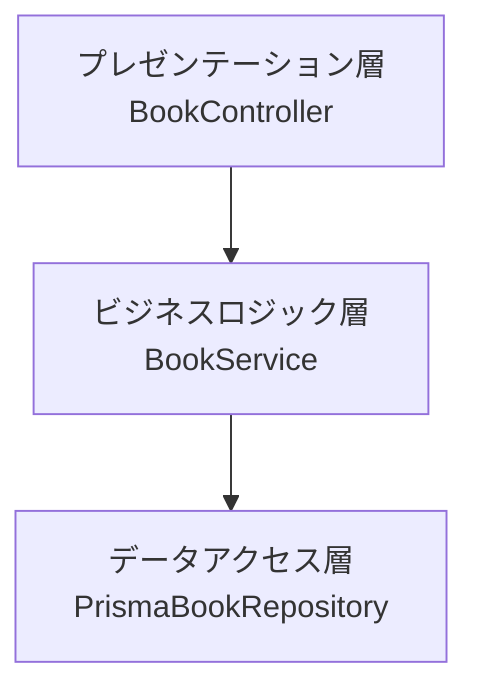
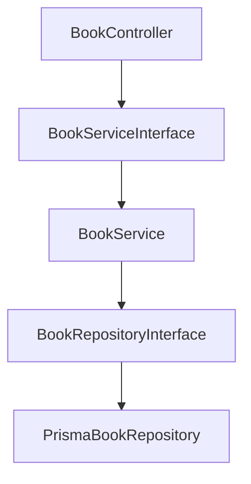

# レイヤードアーキテクチャの役割整理
具体的な設計に入る前に、まずはレイヤードアーキテクチャ（Layered Architecture）における各層の役割を整理しておきましょう。

## プレゼンテーション層（Presentation Layer）
最上位に位置するのが「プレゼンテーション層」です。
この層は主に以下の責務を担います

- 外部（例：フロントエンド）からのHTTPリクエストを受け取る
- 入力値のバリデーションやエラーハンドリングを行う
- 処理結果をレスポンスとして返却する

よくある誤解として「プレゼンテーション層＝フロントエンド」と思われがちですが、ここではフロントエンドからのリクエストを最初に受け取るバックエンドのエントリーポイントを指します。

本プロジェクトでは、HTTPリクエストを受け取り、必要なデータを次のビジネスロジック層に渡し、最終的なレスポンスを構築します。

## ビジネスロジック層（Application / Domain Layer）
プレゼンテーション層の下にあるのが「ビジネスロジック層」です。
この層ではアプリケーションの中核となる処理やビジネスルールを実装します。

たとえば、書籍の登録や検索といった具体的なユースケースを実現するために、受け取った入力を検証し、データアクセス層と連携します。

## データアクセス層（Infrastructure / Data Layer）
最下層に位置するのが「データアクセス層」です。
この層の責務は、データベースとのやり取りです。
- SQLの実行
- トランザクション管理
- データの永続化と取得

今回は[Prisma](Prisma)というORMライブラリを使用して、効率的にデータ操作を行います。

## モジュール構成
- プレゼンテーション層：BookController
  - 書籍登録（POST）や検索（GET）などのHTTPリクエストを受け取る

- ビジネスロジック層：BookService
  - 書籍管理に関するビジネスロジックを実装

- データアクセス層：PrismaBookRepository 
  - Prismaを用いてDB操作を行う

## ディレクトリ構成
プロジェクトルート配下にsrcディレクトリを設け、各レイヤーごとにサブディレクトリを構成します。
```txt
src/
└── presentation/
│   └── BookController.ts
├── application/
│   └── BookService.ts
└── infrastructure/
    └── PrismaBookRepository.ts
```

## 設計時に意識すべき2つのポイント
1. 各層の責務を明確に分離すること
たとえば、
- プレゼンテーション層にビジネスロジックを書かない
- ビジネスロジック層から直接DBアクセスしない
といったレイヤー間の境界を守る意識が、保守性・拡張性の高いアーキテクチャにつながります。

2. 適切な粒度でモジュールを分割すること
書籍登録と検索を別のサービスクラスに分けるのは細かすぎ、
一方で書籍管理と貸出管理を同じサービスにまとめるのは大きすぎです。

「機能ごとのまとまり」を意識して、ちょうどよい粒度で分割しましょう。

## レイヤー構成のMermaid図
以下の図は、今回のアーキテクチャ構成を視覚的に表したものです。


この構成は、処理の責務をプレゼンテーション層・ビジネスロジック層・データアクセス層に分けて整理することで、役割の明確化や見通しの良いコード構成を実現しています。
特に、小規模な開発やスピード重視のプロジェクトでは、このような構成がシンプルで扱いやすいというメリットがあります。

しかし、この設計には上位層が下位層の具体的な実装に強く依存してしまっているという課題があります。
このような密結合な構成では、以下のような問題が発生します
- 単体テストが困難になる
- 実装の差し替えが難しくなる
- 保守性・拡張性が低下する

これらの問題の原因は、各層のモジュールが密接に結びついた「密結合」な状態にあることです。

### 解決策：依存性逆転の原則（DIP）の適用
この問題を解消するために、依存性逆転の原則（DIP: Dependency Inversion Principle）を適用し、依存の方向性を見直した設計に変更します。

以下が改善後の構成です。

この構成では、各層はインターフェースを介して他の層と連携することで、柔軟性とテスト容易性を向上させています。
### 改善点のまとめ
- 各層（プレゼンテーション層、ビジネスロジック層、データアクセス層）はそのまま維持
- インターフェース（Interface）を導入することで、具体実装からの依存を排除
- 上位層は下位層の実装ではなくインターフェースに依存
- 下位層はそのインターフェースを実装する形で責務を果たす

このように設計を見直すことで、各層の結合度を大幅に下げ、柔軟でテストしやすい構成が実現できます。
